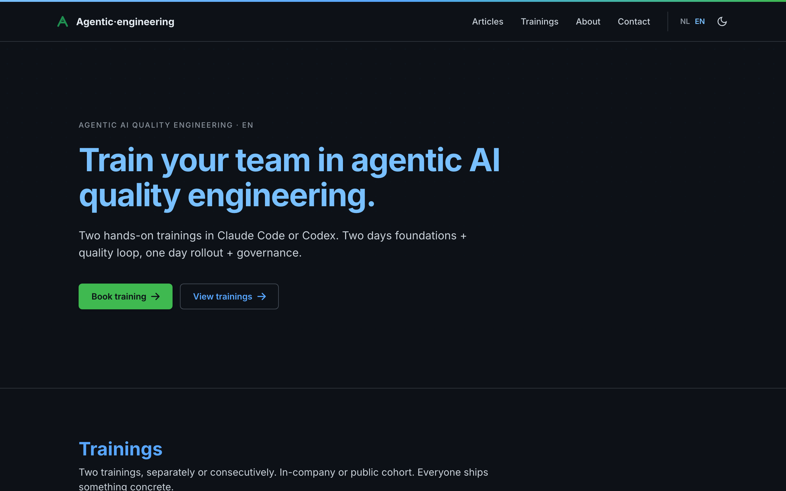

# agenticengineering.nl

Training and curated, valuable news for agentic engineering. Bilingual (NL/EN), dark terminal-native aesthetic, deployed on Vercel.

Live: <https://agenticengineering.nl>



---

## Stack

| Layer           | Choice                                                                        |
| --------------- | ----------------------------------------------------------------------------- |
| Framework       | Next.js 15 (App Router, RSC)                                                  |
| Runtime         | Node.js 20                                                                    |
| Package manager | pnpm 9                                                                        |
| Styling         | Tailwind CSS v4 (`@theme` tokens in `app/globals.css`)                        |
| i18n            | next-intl (NL default, EN alt)                                                |
| Forms           | react-hook-form + Zod                                                         |
| Mail            | Resend                                                                        |
| Payments        | Stripe (Checkout Sessions + webhook signature verification for pilot booking) |
| Tests           | Vitest (unit) + Playwright (e2e + axe a11y)                                   |
| Hosting         | Vercel (Fluid Compute)                                                        |

## Getting started

Prerequisites: Node.js 20 (`.nvmrc`), pnpm 9, git, Claude CLI (`claude`).

```bash
git clone https://github.com/<owner>/agenticengineering.nl.git
cd agenticengineering.nl
nvm use                   # picks Node 20 from .nvmrc
corepack enable           # provides pnpm 9
pnpm install
pnpm exec playwright install   # one-time, only if you'll run e2e
cp .env.example .env.local     # required: copy and fill in for local dev (contact form + feature flags)
pnpm dev                  # http://localhost:3000 → redirects to /nl
```

The pre-commit `readme-check` hook requires the Claude CLI and an Anthropic API key:

```bash
curl -fsSL https://claude.ai/install.sh | bash   # or: brew install --cask claude-code
export ANTHROPIC_API_KEY=<your-api-key>           # add to ~/.zshrc / ~/.bashrc to persist
```

First-run sanity check:

```bash
pnpm typecheck && pnpm lint && pnpm test && pnpm verify:i18n
```

Contact form needs `RESEND_API_KEY`, `CONTACT_FROM_EMAIL`, `CONTACT_EMAIL` in `.env.local` (see [Environment variables](#environment-variables)). Skip if you're only touching UI/copy — the rest of the site renders without them.

Editing checklist:

- UI/copy → read `PRODUCT.md` + `DESIGN.md` first.
- New translation key → add to **both** `messages/nl.json` and `messages/en.json`; `pnpm verify:i18n` gates CI.
- New training → add a `Training` entry in `data/trainings.ts` (typed: `id`, `durationDays`, `priceEUR`, `modules[]`, `deliveryFormats[]`, plus optional `schedule` and `earlyBird`) and add its copy keys to **both** `messages/{nl,en}.json` under `trainings.<id>` (`name`, `tagline`, `audience[]`, `prerequisites[]`, `outcomes[]` — plus `earlyBirdNote` when the training has an `earlyBird`), plus `trainings.duration.<id>` and `trainings.cardMeta.<id>`. A scheduled date is **optional** and lives in two places: the human-facing date inside the `name` string in parentheses (e.g. `"Pilot - Basic Training (June 29th & 30th 2026)"` / `"... (29 en 30 juni 2026)"`, localised per file), and — for trainings that run on a known date — a machine-readable `schedule` field on the `Training` (ISO `startDate`/`endDate` + `courseMode: ['online']`). The `schedule` drives the schema.org `CourseInstance` in the structured data (`lib/structured-data.ts`); omit both for trainings with no fixed date. An optional `earlyBird` (`{ discountPct, deadline }`, with the deadline as an ISO string carrying an explicit timezone offset) applies a **server-enforced** discount while `now` is strictly before the deadline — see `priceFor()` in `lib/pricing.ts`; the card and detail page then render the struck base price, the discounted price, and the `earlyBirdNote`. New module IDs need a matching block under `modules.<module-id>` (`title`, `bullets[]`, `short`) in both files. Use kebab-case IDs; reuse existing module IDs where the content overlaps.
- Significant feature change (new/reworked training, etc.) → capture the design in a dated spec under `docs/superpowers/specs/<YYYY-MM-DD>-<slug>.md`, and (for multi-step work) a step-by-step implementation plan under `docs/superpowers/plans/<YYYY-MM-DD>-<slug>.md`.
- New route → add it under `app/[locale]/`, give it a `generateMetadata` via `export const generateMetadata = metadataFor('/about', 'pages.about')` (the `metadataFor(path, key)` wrapper reads `meta.<key>.title`/`.description`, both locales). Pages with a dynamic param, non-`meta` namespace, or a composed title call `buildPageMetadata({ locale, path, title, description })` directly (see `app/[locale]/trainings/[trainingId]/page.tsx`). Add the path to `app/sitemap.ts` (the sitemap is an explicit `PATHS` list — training detail pages are derived from `data/trainings.ts`, other routes are listed by hand).
- API/server logic → keep validation in `lib/validation.ts`, side effects in `lib/*`.
- New news article → create `news/<slug>.md` with required frontmatter (see below). Run `pnpm article:image <source-url> <slug>` to fetch and save the OG image before committing.
- Pre-commit `lefthook` hook runs `format`, `lint`, and `readme-check` (validates README stays in sync; requires `claude` CLI + `ANTHROPIC_API_KEY`). Don't bypass with `--no-verify` unless you're fixing the hook itself.
- Bookable trainings (self-serve Stripe checkout) are the set in `bookableTrainingEnum` (`lib/validation.ts`) — currently `pilot` and `discount-aug-26`. Each one needs its booking routes (`/trainings/<id>/book` + `/trainings/<id>/book/success`) and, in both `TrainingCard.tsx` and `TrainingDetail.tsx`, its booking CTA (`/trainings/<id>/book`) and secondary contact link kept in sync. Each booking page file (`app/[locale]/trainings/<id>/book/page.tsx`) must fetch the training name from `getTranslations('trainings')` and pass it to the booking messages as `{ trainingName }` (both `booking.title` and `booking.intro` expect it) — see `app/[locale]/trainings/pilot/book/page.tsx` for the pattern.
- The primary CTA label is conditional in both components (`isBookable ? 'bookCta' : 'requestCta'`, where `isBookable` is membership of `bookableTrainingEnum`): bookable trainings show `trainings.labels.bookCta` ("Book training" / "Boek training"), the rest show `trainings.labels.requestCta` ("Request training" / "Vraag training aan").
- The `/trainings` overview and the homepage render a **curated, ordered** list of cards (`DISPLAYED_TRAININGS` in `app/[locale]/trainings/page.tsx`; hardcoded cards on the homepage), not every entry in `data/trainings.ts`. `basic` stays in the dataset (its detail route still resolves and it is the template the dated cohorts mirror) but is not shown as a card.

### News article frontmatter

```yaml
title_nl: 'NL title' # required
title_en: 'EN title' # required
url: 'https://...' # required — canonical link shown to readers
source_url: 'https://...' # optional — URL visited to scrape og:image (defaults to url)
type: article # optional — 'article' (default) or 'blog'
date: 'YYYY-MM-DD' # required
author: 'First Last' # optional
placed_by: 'Name' # optional — who curated this entry
summary_nl: '...' # required
summary_en: '...' # required
image: '/news/<slug>.jpg' # optional — path relative to /public; falls back to /qas-icon.svg
```

Fetch the image with:

```bash
pnpm article:image <source-url> <slug>
# Example: pnpm article:image https://medium.com/some-post my-article-slug
```

"The script reads the page's `og:image` in headless mode, downloads it, and saves it to `public/news/<slug>.<ext>`. The source host **and** the image host must both be listed in `data/trusted-domains.json` — add new domains there when needed.

Deploy: push to `main` → auto-prod via Vercel GitHub App. Push any other branch → preview URL (see [Preview environment](#preview-environment)).

## Layout

```
app/
  [locale]/            # NL/EN routed pages (home, about, contact, impressum)
  api/checkout/        # POST handler — creates Stripe Checkout Session
  api/contact/         # POST handler — Zod + rate-limit + Resend
  api/stripe/webhook/  # POST handler — Stripe webhook signature verification + fulfillment
  robots.ts            # /robots.txt
  sitemap.ts           # /sitemap.xml
  globals.css          # Tailwind v4 @theme block (single source of design tokens)
components/            # Hero, Nav, Footer, TrainingCard, TrainingDetail, ContactForm,
                       # BookingForm, ArticleFilterBar, InstructorCard, Button, DayAgenda,
                       # ProofStrip, TimelineEntry, JsonLd, LangSwitcher, MobileMenu, …
lib/
  validation.ts        # Zod schemas (contactSchema, bookingSchema, trainingInterestEnum, …)
  email.ts             # Resend wrapper, sendContactEmail(), sendBookingConfirmation(), sendBookingNotification()
  rate-limit.ts        # Per-IP token bucket (in-memory; per-instance)
  http.ts              # HTTP utilities (isAllowedOrigin, clientIp for origin/IP validation)
  sanitize.ts          # CRLF strip for email headers
  articles.ts          # Article/news loader (reads news/ markdown files)
  parseFrontmatter.ts  # Frontmatter parser for markdown articles
  flags.ts             # Feature flag helpers (BLOGS_ENABLED, …)
  pricing.ts           # VAT calculation + `priceWithVat` function
  stripe.ts            # Stripe client factory with memoization (getStripe, __resetStripeForTests)
  webhook-dedupe.ts    # Webhook event deduplication (markHandled, unmarkHandled, __resetWebhookDedupeForTests)
  structured-data.ts   # schema.org JSON-LD graph builder for the homepage (buildHomeJsonLd)
  page-metadata.ts     # metadataFor(path, key) wrapper + buildPageMetadata({ locale, path, title, description }) — single source for per-page SEO (canonical, hreflang, OpenGraph)
data/                  # typed catalogues (trainings.ts, instructors.ts, testimonials.ts) + trusted-domains.json
  trainings.ts         # Training catalogue + modules (typed)
  instructors.ts       # Instructor profiles (typed)
  testimonials.ts      # Testimonial quotes (typed, verbatim — name/role not translated)
  trusted-domains.json # Allowlist for origin/CSRF checks
news/                  # Markdown news + blog posts (frontmatter + body)
i18n/                  # next-intl config (routing.ts, request.ts)
messages/              # nl.json, en.json (translation keys)
scripts/
  verify-i18n.ts       # CI gate: NL/EN key parity
  fetch-article-images.ts # Downloads OG images for news articles
  metrics.ts           # Site metrics helper
tests/                 # Vitest unit + Playwright e2e
docs/
  superpowers/specs/   # Design specs for significant feature changes (dated markdown)
  superpowers/plans/   # Step-by-step implementation plans (dated markdown, checkbox tasks)
PRODUCT.md             # Brand register (users, tone, anti-references, principles)
DESIGN.md              # Design system (colors, typography, components, do's/don'ts)
CLAUDE.md              # Operational shortlist for agents (commands, conventions, deployment)
LICENSE                # MIT license (© QualityAtSpeed)
next.config.ts         # Security headers + next-intl plugin
```

## Local development

```bash
pnpm install
pnpm dev                  # http://localhost:3000 (auto-redirects /  → /nl)
```

Routes:

- `/nl`, `/en` — locale-scoped pages
- `/nl/about`, `/nl/contact`, `/nl/impressum` (and `/en/*`)
- `/[locale]/trainings` — trainings overview
- `/[locale]/trainings/[trainingId]` — training detail page
- `/[locale]/trainings/<id>/book` — booking form for each bookable training (`pilot`, `discount-aug-26`)
- `/[locale]/trainings/<id>/book/success` — post-payment UX
- `POST /api/contact` — POST endpoint
- `POST /api/checkout` — creates Stripe Checkout Session
- `POST /api/stripe/webhook` — Stripe fulfillment webhook
- `/sitemap.xml`, `/robots.txt`
- `/llms.txt` — static machine-readable site summary for AI crawlers/assistants (`public/llms.txt`, hand-maintained; update prices/dates/links when trainings change)

### Discoverability for AI assistants

Assistants (ChatGPT, Claude) surface the site through their web-search tools, so discoverability rides on standard crawlability plus machine-readable facts:

- `robots.txt` allows all user agents (GPTBot, ClaudeBot, OAI-SearchBot included).
- `lib/structured-data.ts` builds the homepage schema.org graph: `Organization` + one `Course` per training, with a `CourseInstance` (online mode + ISO dates) for any training carrying a `schedule`. Keep this the single source — don't re-inline JSON-LD in pages.
- `public/llms.txt` gives crawlers a concise overview with deep links.

Out of scope for the repo (one-time, owner-side): submitting the sitemap to Bing Webmaster Tools (ChatGPT leans on Bing) and Google Search Console.

### Useful scripts

```bash
pnpm typecheck            # tsc --noEmit
pnpm lint                 # eslint
pnpm test                 # vitest run (unit)
pnpm test:e2e             # playwright (requires `pnpm exec playwright install` once)
pnpm verify:i18n          # NL/EN translation key parity check
pnpm build                # production build
pnpm format               # prettier --write .
```

A pre-commit `lefthook` hook runs `format`, `lint`, and `readme-check`. The `readme-check` command calls the Claude CLI — requires `ANTHROPIC_API_KEY` set in your shell. Don't bypass with `--no-verify` unless you're fixing the hook itself.

## Environment variables

Copy `.env.example` to `.env.local` and fill in the keys you need. Everything except the contact-form and Stripe keys has a safe default when unset.

```bash
cp .env.example .env.local
```

| Key                      | Scope       | Purpose                                                                                                                                                      |
| ------------------------ | ----------- | ------------------------------------------------------------------------------------------------------------------------------------------------------------ |
| `RESEND_API_KEY`         | server      | Auth for Resend API (40+ char `re_...` token). Never a placeholder. Separate key per env.                                                                    |
| `CONTACT_FROM_EMAIL`     | server      | FROM address on outbound mail. Must be on a Resend-verified domain. Currently `hello@agenticengineering.nl`.                                                 |
| `CONTACT_EMAIL`          | server      | TO address (inbox that receives form submissions). Differs by env (see Preview section below).                                                               |
| `BLOGS_ENABLED`          | server      | Feature flag for blog entries on `/articles`. Set to `'true'` to show blog entries and the all/blogs/articles filter bar. Unset/empty hides both. See below. |
| `TESTIMONIALS_ENABLED`   | server      | Feature flag for the homepage testimonials section. Set to `'true'` to show it; unset/empty hides it. Stays hidden until real content exists.                |
| `STRIPE_SECRET_KEY`      | server      | Stripe secret API key for creating Checkout Sessions and verifying webhooks.                                                                                 |
| `STRIPE_PUBLISHABLE_KEY` | client-safe | Stripe publishable key (reserved for future Elements; redirect uses the Session URL).                                                                        |
| `STRIPE_WEBHOOK_SECRET`  | server      | Signing secret for `/api/stripe/webhook` signature verification.                                                                                             |

The three contact-form keys are set in **Production** and **Preview** scopes (Development scope is intentionally empty — local dev uses `.env.local`). `BLOGS_ENABLED` is set per-scope as needed (see Feature flags below). Set via Vercel CLI or UI:

```bash
vercel env add RESEND_API_KEY production
vercel env add CONTACT_FROM_EMAIL production
vercel env add CONTACT_EMAIL production
vercel env add STRIPE_SECRET_KEY production
vercel env add STRIPE_PUBLISHABLE_KEY production
vercel env add STRIPE_WEBHOOK_SECRET production

vercel env add RESEND_API_KEY preview
vercel env add CONTACT_FROM_EMAIL preview
vercel env add CONTACT_EMAIL preview
vercel env add STRIPE_SECRET_KEY preview
vercel env add STRIPE_PUBLISHABLE_KEY preview
vercel env add STRIPE_WEBHOOK_SECRET preview
```

Or paste real values in Vercel UI → Project → Settings → Environment Variables. After editing, redeploy (`vercel --prod` for production, or push a branch for preview) for new values to land in the function.

Local dev does not need these (contact form requires them at runtime). For local mail testing, create `.env.local` with the same keys.

### Feature flags

`BLOGS_ENABLED` gates the blog feature on `/articles`. Implementation in `lib/flags.ts`.

| Value                         | Behavior                                                                                                |
| ----------------------------- | ------------------------------------------------------------------------------------------------------- |
| `'true'`                      | Blog entries (frontmatter `type: blog`) appear on `/articles`; filter bar (all/blogs/articles) renders. |
| unset / empty / anything else | Blog entries are filtered out; filter bar is hidden entirely.                                           |

Production stays gated until launch. To preview the flag locally, set `BLOGS_ENABLED=true` in `.env.local` (or inline: `BLOGS_ENABLED=true pnpm dev`). Playwright e2e already sets it via `playwright.config.ts` so the filter-bar tests run.

When flipping the flag on in Vercel, set it for the relevant scope:

```bash
vercel env add BLOGS_ENABLED preview     # paste: true
vercel env add BLOGS_ENABLED production  # paste: true (when ready to launch)
```

`TESTIMONIALS_ENABLED` gates the homepage testimonials section (`components/TestimonialsSection.tsx`). Unset/empty (or any value other than `'true'`) hides the section entirely. Content lives in `data/testimonials.ts` (verbatim quotes); the section also self-hides when that array is empty.

## Contact form pipeline

```
Browser → POST /api/contact → app/api/contact/route.ts
                ├─ Origin allowlist (CSRF)        → 403 if mismatch
                ├─ Per-IP rate-limit              → 429 if exceeded
                ├─ Honeypot `website` field       → 200 silent-drop if set
                ├─ Zod contactSchema validate     → 400 if invalid
                └─ lib/email.ts → Resend.emails.send()
                                  ├─ EmailError → 502
                                  └─ ok → 200
```

Allowed origins (regex in `app/api/contact/route.ts`):

- `https://agenticengineering.nl` and `https://www.agenticengineering.nl`
- `https://agenticengineering*.vercel.app`
- `http://localhost(:port)`

To-field is never user-controlled. CRLF-stripped via `lib/sanitize.ts` to prevent header injection.

## Pilot booking pipeline

```
Browser → POST /api/checkout → app/api/checkout/route.ts
                ├─ Server-side pricing from data/trainings.ts via priceFor() (early-bird date-conditional, +21% VAT)
                └─ lib/stripe.ts → Stripe Checkout Session
                                   └─ redirect to Stripe-hosted checkout

Stripe → POST /api/stripe/webhook → app/api/stripe/webhook/route.ts
                ├─ Signature verification (STRIPE_WEBHOOK_SECRET)
                ├─ completed / async_payment_succeeded  → only if payment_status === 'paid'
                │                  ├─ Resend confirmation email to customer  ← critical
                │                  └─ Resend notification to operator        ← best-effort, production-only
                └─ async_payment_failed                 → logged, no fulfillment
```

Fulfillment happens on the webhook, never on the success redirect. The success page (`/[locale]/trainings/pilot/book/success`) is purely cosmetic — it cannot be trusted as proof of payment.

**Delayed-notification methods (iDEAL, Bancontact, …).** These fire `checkout.session.completed` _before_ the money clears, then a `checkout.session.async_payment_succeeded` (or `_failed`) once it settles. The webhook fulfils on either event but **only when `session.payment_status === 'paid'`**, so an unpaid `completed` is ignored and the async success event does the fulfilment — exactly one confirmation per booking. `async_payment_failed` is logged and not fulfilled. (Instant payments are already paid at `completed`, so they fulfil immediately.) See [Stripe's delayed-notification fulfillment docs](https://docs.stripe.com/payments/checkout/fulfillment#delayed-notification).

The two email sends use distinct error handling to prevent duplicate customer confirmations:

- **Customer confirmation** is critical: if it throws, the event id is un-marked and the webhook returns 500, allowing Stripe to retry. Because the confirmation never sent, the retry is safe (no duplicate).
- **Internal notification** is best-effort and **production-only**: it is gated on `VERCEL_ENV === 'production'`, so preview/dev submissions skip the operator email entirely. In production it is sent to the configured `CONTACT_EMAIL` (TO) address; if it throws, the error is logged and the webhook still returns 200. The event id stays marked, so no Stripe retry occurs and the customer never receives a duplicate confirmation. A missed notification is acceptable because the booking is visible in the Stripe Dashboard.

### Stripe on preview deployments

Payment testing happens on **one designated preview environment**: the `preview` branch. All previews share one Stripe sandbox (sandboxes are Dashboard-only, no create API); only the designated branch has a working webhook:

- The sandbox holds **one manually created webhook endpoint** pointing at the `preview` branch's stable URL (`/api/stripe/webhook`); its `whsec_` lives in Vercel as `STRIPE_WEBHOOK_SECRET` on the Preview environment. Set up once in the Stripe + Vercel dashboards, then left alone.
- The sandbox's `STRIPE_SECRET_KEY` is on Vercel's Preview environment, so **every** PR preview has a working checkout redirect — but only bookings made on the designated `preview` branch get webhook fulfillment (confirmation email). That's the payment-test environment.
- Because previews sit behind Vercel **Deployment Protection**, external callers (Stripe) get a 401 unless the registered webhook URL carries the bypass token (`?x-vercel-protection-bypass=…`, from Vercel → Settings → Deployment Protection → Protection Bypass for Automation) — unless the designated domain is excluded from protection.

An earlier iteration auto-provisioned a webhook endpoint + branch-scoped secret per PR branch via a `stripe-preview.yml` workflow; it was removed in favour of this simpler designated-environment setup (the automation had non-atomic provisioning and cleanup edge cases — see PR #74).

## Security headers

Set in `next.config.ts`. Apply only in production (dev keeps relaxed for local tooling).

- `Strict-Transport-Security: max-age=63072000; includeSubDomains; preload`
- `X-Content-Type-Options: nosniff`
- `X-Frame-Options: DENY`
- `Referrer-Policy: strict-origin-when-cross-origin`
- `Permissions-Policy: camera=(), microphone=(), geolocation=()`
- `Content-Security-Policy:` `default-src 'self'; script-src 'self' 'unsafe-inline'; style-src 'self' 'unsafe-inline'; img-src 'self' data:; font-src 'self' data: https://fonts.gstatic.com; connect-src 'self' https://api.resend.com; frame-ancestors 'none'; base-uri 'self'; form-action 'self'`

## Deployment

### One-time

```bash
brew install vercel-cli
vercel login
vercel link              # links cwd to existing Vercel project
```

### Deploy

```bash
vercel --prod            # production deploy + alias to apex
```

Vercel GitHub App is connected, so pushes to `main` auto-deploy to production and pushes to any other branch auto-deploy to a preview URL. Manual `vercel --prod` still works for out-of-band hot deploys.

A GitHub Actions workflow (`.github/workflows/discord-pr.yml`) posts PR notifications to a Discord channel when PRs open or merge, plus a manual `workflow_dispatch` (with a `pr_number` input) to publish any PR on demand. Set the `DISCORD_WEBHOOK` secret in GitHub repo settings to enable it; the workflow skips silently when the secret is unset.

### DNS (TransIP)

Mail and web records coexist on the same zone.

**Web (Vercel):**

| Name  | Type  | Value                                         |
| ----- | ----- | --------------------------------------------- |
| `@`   | A     | `76.76.21.21`                                 |
| `www` | CNAME | `cname.vercel-dns.com.` _(note trailing dot)_ |

**Mail (Resend — for `hello@agenticengineering.nl` sending):**

| Name                | Type | Value                                                                  |
| ------------------- | ---- | ---------------------------------------------------------------------- |
| `resend._domainkey` | TXT  | `p=…` _(DKIM, copy from Resend dashboard)_                             |
| `send`              | MX   | `feedback-smtp.eu-west-1.amazonses.com.` _(trailing dot, priority 10)_ |
| `send`              | TXT  | `v=spf1 include:amazonses.com ~all`                                    |
| `_dmarc`            | TXT  | `v=DMARC1; p=none;`                                                    |

**Mail (TransIP — apex inbox, unrelated to outbound sending):** existing MX `mx.transip.email.`, SPF `_spf.transip.email`, DKIM CNAMEs `transip-{a,b,c}._domainkey`. Untouched by Vercel migration.

TransIP gotcha: any record value that should resolve as an absolute FQDN **must end with a `.`** (MX, CNAME). Otherwise TransIP auto-appends the zone apex and breaks resolution.

### Verifying a deploy

```bash
curl -sI https://agenticengineering.nl/nl
# Expect: HTTP/2 200, all 6 security headers present.

curl -s -X POST https://agenticengineering.nl/api/contact \
  -H 'Content-Type: application/json' \
  -H 'Origin: https://agenticengineering.nl' \
  -d '{"name":"t","email":"t@example.com","trainingInterest":"basic","deliveryPref":"noPreference","message":"smoke test 0123456789","website":""}'
# Expect: {"ok":true}
```

## Preview environment

Every non-main branch push gets a Vercel preview deployment at `https://agenticengineering-<hash>-<scope>.vercel.app`. Previews exist to smoke-test code before promotion to production without touching the live inbox.

**Isolation from production:**

| Concern        | Production                            | Preview                                                                                |
| -------------- | ------------------------------------- | -------------------------------------------------------------------------------------- |
| Resend API key | full-access key (prod-only)           | separate domain-scoped key (revocable independently)                                   |
| FROM address   | `hello@agenticengineering.nl`         | `hello@agenticengineering.nl` (same verified sender)                                   |
| TO address     | `hello@agenticengineering.nl`         | `hello+preview@agenticengineering.nl` (plus-addressing — same inbox, filterable label) |
| URL            | `agenticengineering.nl` (+ www alias) | `agenticengineering-<hash>-<scope>.vercel.app`                                         |
| Access         | public                                | SSO wall (see below)                                                                   |

The plus-addressing trick (`hello+preview@…`) routes preview submissions to the same mailbox as production but with a `+preview` label, so a Gmail/IMAP filter can sort them automatically without provisioning a second mailbox. The `+` part is stripped by the SMTP server during delivery — `hello+anything@…` always lands at `hello@…`.

**SSO wall (Hobby tier limitation):**

Vercel Deployment Protection is forced on for previews on the Hobby plan. Public access (no Vercel login) requires upgrading to a paid tier. Three ways to access previews under the current plan:

1. **Browser, logged in:** open the preview URL, get redirected to Vercel SSO, sign in with the project-owner account → preview loads. Works for the project owner; not for external testers.
2. **CLI, authenticated:** `vercel curl <preview-url>/path` auto-injects a bypass token from your local Vercel auth. Use this for smoke tests:

   ```bash
   vercel curl https://agenticengineering-<hash>-<scope>.vercel.app/nl -I
   # Expect: HTTP/2 200

   vercel curl https://agenticengineering-<hash>-<scope>.vercel.app/api/contact \
     -X POST -H 'Content-Type: application/json' \
     -H 'Origin: https://agenticengineering-<hash>-<scope>.vercel.app' \
     -d '{"name":"preview probe","email":"t@example.com","trainingInterest":"basic","deliveryPref":"noPreference","message":"preview smoke 0123456789","website":""}'
   # Expect: {"ok":true}; mail lands at hello+preview@agenticengineering.nl
   ```

3. **Share with an external tester:** generate a one-off bypass URL — Vercel UI → Project → Settings → Deployment Protection → "Protection Bypass for Automation" → generate token, then share `https://<preview-url>/path?x-vercel-set-bypass-cookie=true&x-vercel-protection-bypass=<token>`. Sets a cookie so subsequent navigation within the preview works.

**Rotating the preview Resend key:**

The preview key has Resend "Sending access" scoped to `agenticengineering.nl` only. To rotate: Resend dashboard → API Keys → revoke old → create new → `vercel env rm RESEND_API_KEY preview && vercel env add RESEND_API_KEY preview` (paste new value at the prompt — never via `--value` on a shared terminal) → trigger a new preview deploy. Production is unaffected.

**Cleanup:**

Preview deployments are automatically deleted when their PR closes (via `.github/workflows/preview-teardown.yml`).

## i18n

Translation messages live in `messages/{nl,en}.json`. Locale routing in `i18n/routing.ts`. NL is the default locale (no prefix-less root — `/` redirects to `/nl`).

CI runs `pnpm verify:i18n` to enforce key parity between NL and EN. Add a new key → add it to both files.

Namespaces in use: `meta`, `nav`, `hero`, `trainings`, `modules`, `proof`, `footer`, `about`, `articles`, `contact`, `booking`, `impressum`, `theme`, `home`, `why`. The `booking` namespace covers the pilot seat-selector form (`seatsLabel`, `attendeeName`, `attendeeEmail`, `submit`, `submitting`, `contactLink`, `errors.*`, `success.*`).

## Testing

- **Unit** (`tests/**/*.test.ts`): Vitest, jsdom env for component tests. `pnpm test`.
- **E2E** (`tests/e2e/`): Playwright, hits dev server. `pnpm test:e2e`.
- **A11y**: axe-core integrated into Playwright tests. Zero WCAG 2.1 AA violations enforced.

CI workflow: `.github/workflows/ci.yml` runs typecheck + lint + unit + i18n integrity gate on every push.

## Brand and design context

- `PRODUCT.md` — who the site is for, tone of voice, anti-references, strategic principles.
- `DESIGN.md` — Stitch-format design system: colors (OKLCH dark palette), typography (JetBrains Mono display, Inter body), components, do's/don'ts.

These two files inform every UI decision. Read them before touching components.

- `CLAUDE.md` — agent-facing operational shortlist (commands, layout, conventions, pre-commit hook, deployment). Complements this README rather than duplicating it.

## Contributing

Contributions are welcome. See [`CONTRIBUTING.md`](./CONTRIBUTING.md) for local setup, the test/lint gates your change must pass, and PR conventions. By participating you agree to the [Code of Conduct](./CODE_OF_CONDUCT.md).

## Security

Please do not open public issues for security vulnerabilities. See [`SECURITY.md`](./SECURITY.md) for how to report them privately.

## License

Released under the [MIT License](./LICENSE). © QualityAtSpeed.
